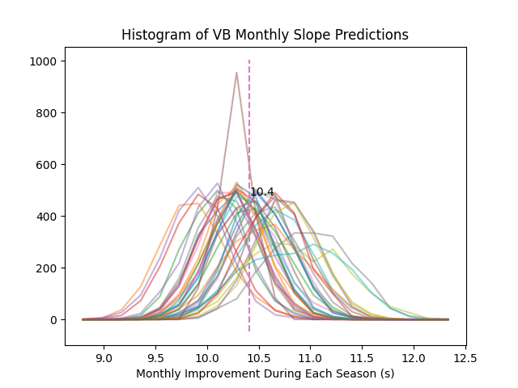
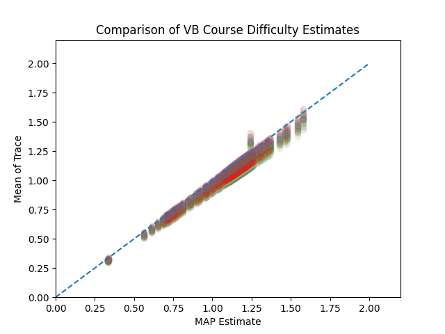
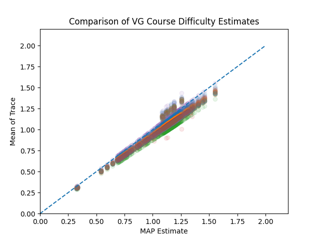

## Introduction
This code estimates the difficulty of cross country (XC) courses. 
The goal is to provide a single number that models each course's difficulty 
and can be used to adjust expected race times across courses.
For example, course A might be 1.1 times harder than course B,
and thus the expected times for course A will be 10% higher.

Using race results from [XCStats](https://xcstats.com/)
over multiple years,
this code builds a model that takes into account these different factors:

  * Course difficulty
  * Runner's inate ability
  * Runner's month-to-month improvement over the season
  * Runner's year-to-year improvement over their career

The model estimates a single number (ability or difficulty) for 
each runner and each course.
While the month-to-month and year-to-year parameters
are averages that apply to all runners.

To be more specific, given each runner's race times, 
the model fits parameters
to a mathematical model that looks like this:

```
race_time = (average_race_time - race_month*month_slope - student_year*year_slope)
            * runner_ability * course_difficulty
``````
Here, the race times are in seconds.
The race_month is the numerical month, starting with September which is 0.
The student_year is the high-school year of the student, where freshman is 0.
Thus the slopes are in terms of seconds per month or year, 
to make the results easier to interpret.

There is an individual parameter for each runner's ability, and as well as an
individual course_difficulty for each course.  These are both
multiplicative factors that modify the expected race time during the season. 
Both factors adjust the
expected times, but in different fashions.  So higher (>1) course difficulties
represent *harder* courses.  While lower (<1) runner abilities represent *faster*
runners. In both cases, higher numbers translate to longer finish times.

Note, the raw outputs from this model are unnormalized and should be considered
*relative* results. 
While both the ability and difficulty numbers tend to be close to 1, 
their baselines are arbitrary.
Thus an average course_difficulty of 0.5 and an average runner ability of 2 will
produce the same overall race-time predictions as the reverse.  This is 
explained below in the section on traces.

## [Bayesian Modeling](https://www.publichealth.columbia.edu/news/what-bayesian-modeling#:~:text=Bayesian%20modeling%20is%20able%20to,estimated%20toxicities%20of%20certain%20pollutants.)
We use a Bayesian framework to fit a probabilistic model to explain
the observed data (runner's race times).
In a Bayesian model all the parameters of the model are considered random
variables. We don't know Kent's true ability, so it is a random variable. 
Likewise, the difficulty of Crystal changes with the weather and other variables
we do not have control over. Our goal is to find probability distributions that
are as narrow as possible to explain the observed data.

By way of contrast, a deterministic model such as linear regression finds the
model parameters that produce the smallest possible error
(in the mean-squared sense)
when predicting the observed times.
Instead, here we use a Bayesian model so we can model and 
describe the uncertainties in our predictions.

An important part of Bayesian modeling is providing information about 
expectations of the parameters. In this case, we wish the course and runner
parameters to be approximately 1.0. This kind of constraint is added to the 
Bayesian model in the form of prior distributions.

We have 4 years of high school race results from the subscribers to
[XCStats.com](xcstats.com).
This includes 70k boys results and 63k girls results.
For the analysis presented here, we use the runners with times in the top 25\%
of each race, hypothesizing that these are likely to be the more serious runners
and will show less variance in their performance.
This left us with 22k boys
results and 19k girls results.
Our boy's model was traimed with 3919 runners 
running 443 courses.
While the girl's model was trained with 3229 runners running
432 courses.

Given our race results, we find the probability distribution for the parameters
that best explains the data using a
Python package called [PyMC](https://www.pymc.io/welcome.html).


## Results

The goal of this exercise is to estimate the relative difficulty of each course
in our dataset. Here are the results for a number of courses run by local 
high school teams (Palo Alto, Los Altos, Archbishop Mitty, and Lynbrook):

|Index | Course Name                      | Boys Difficulty | Girls Difficulty | # Boys | # Girls |
|-----:|---------------------------------:|:---------------:|:----------------:|-------:|--------:|
|  248 | RL Stevenson HS (1.6)            | 0.5259          |0.5103            |   82   |    73   |
|  150 | Woodward Park (2.0)              | 0.6465          |0.6425            |   53   |    51   |
|    7 | Lynbrook HS (2.1)                | 0.6503          |0.6437            |  330   |   336   |
|  125 | Fremont HS (2.05)                | 0.6514          |0.6437            |   23   |    23   |
|  392 | Hidden Valley Park (2.0)         | 0.6592          |0.6616            |  624   |   624   |
|  218 | Bol Park (2.18)                  | 0.6761          |0.6683            |  131   |   104   |
|  198 | Prospect HS (2.15)               | 0.6832          |0.6826            |   19   |    20   |
|   63 | Lagoon Valley Park (2.0)         | 0.6977          |0.7020            |  100   |    79   |
|    0 | North Monterey County HS (2.4)   | 0.7291          |0.7195            |   14   |    13   |
|  146 | Central Park (2.3)               | 0.7404          |0.7402            |  271   |   265   |
|  377 | Westmoor HS (2.33)               | 0.7412          |0.7407            |  109   |    83   |
|   61 | Westmoor HS '18 (2.4)            | 0.7805          |0.7582            |   91   |    50   |
|  256 | Westmoor HS (2.4)                | 0.7824          |0.7798            |  243   |   190   |
|  222 | Golden Gate Park (2.82)          | 0.9127          |0.9038            |  212   |   174   |
|  365 | Golden Gate Park (2.93)          | 0.9476          |0.9446            |  761   |   635   |
|  220 | Newhall Park (2.95)              | 0.9608          |0.9524            |  139   |   115   |
|  117 | North Monterey County HS (3.0)   | 0.9629          |0.9649            |   54   |    58   |
|  319 | GGP - WCAL pre 2022 (3.0)        | 0.9839          |0.9814            |  156   |   135   |
|  153 | Kualoa Ranch (3.0)               | 0.9919          |0.9787            |   68   |    69   |
|  174 | Haggin Oaks Golf Course (3.1)    | 0.9929          |0.9847            |  758   |   683   |
|   11 | Stanford Golf Course (3.1)       | 0.9932          |0.9882            | 1310   |  1106   |
|  371 | Elkhorn Country Club (3.1)       | 0.9962          |0.9865            |  773   |   674   |
|  298 | Kualoa Ranch (3.1)               | 0.9963          |0.9794            |   29   |    24   |
|  178 | Newhall Park (3.0)               | 0.9970          |0.9907            |  877   |   787   |
|  304 | Crystal Springs (2.95)           | 1.0000          |1.0000            | 2728   |  2552   |
|  188 | Mt. Sac (2.93)                   | 1.0008          |1.0051            | 3407   |  3080   |
|   88 | Woodward Park (3.1)              | 1.0122          |1.0064            | 5473   |  5264   |
|  193 | Lagoon Valley Park (3.0)         | 1.0170          |1.0148            |  508   |   403   |
|  109 | Hidden Valley Park (3.0)         | 1.0179          |1.0122            |  362   |   313   |
|   85 | Baylands Park (3.1)              | 1.0188          |1.0160            |  685   |   684   |
|  192 | Toro Park (3.0)                  | 1.0236          |1.0238            |  704   |   665   |
|  312 | Glendoveer Golf Course, OR (3.1) | 1.0504          |1.0397            |   54   |    58   |
|   70 | Mt. Sac (3.1)                    | 1.0524          |1.0153            |   21   |    10   |

Our model has three point variables 
(average_race_time, monthly_slope, yearly_slope) and two vector variables
(runner_ability, course_difficulty). The runner and course variables have 
one value for each runner and each course, respectively.
Runners typically improve month over month
during the season, and each year they participate in XC.
This model predicts the following improvements:

| | Monthly Improvement | Yearly Improvement |
|----:|:----:|:---:|
| Boys | 5.8s | 8.51s |
| Girls | 8.37s | 4.87s |

### Ill Posed
This model is [ill-posed](https://en.wiktionary.org/wiki/ill-posed)
and this affects our analysis. 
We have a multiplicative model and in effect we are multiplying A x B x C to predict D.
While we have constraints on the expected values of A, B, and C (via a prior
distribution), a larger value of A can be matched with lower values for B and C
to predict the same observed race time. 
This affects the model's slope parameters, but we are interested in the 
relative course difficulties, so we normalize all results to the difficulty
of the Crystal Springs course, and the ill-posed nature is washed out.

[MCMC](https://en.wikipedia.org/wiki/Markov_chain_Monte_Carlo) predicts the
distribution of each model parameter by finding values that result in a high
likelihood when scoring the observed data.
Each time MCMC is run it produces a "trace" of all the model parameters that 
explain the data.  The values of the trace are an empirical description of the 
probability distribution for that model parameter. Most importantly, since
the trace is random, some traces might assume a lower value of A, and thus 
high values of B or C, all to explain the same observed data.

The randomness of each trace makes it harder to draw conclusions. For the 
results presented here, we computed 8 traces, with 2000 samples of each 
model parameter (this took about 5 hours for each gender's data).
The final course difficulty numbers are based on averaging all 16000 trace
samples for each course, and then dividing by the average difficulty of the 
Crystal Springs course, our baseline course.

### Slope Results
The distribution of the monthly slope for the varsity boys is shown below
for each of the eight traces.



We can do the same plot for the improvement of the varsity boys year over year.


The next figures shows the tradeoff between course difficulties and slopes.


For traces where the slopes are low, the course difficulties are relatively high.
Conversely, where the slopes are high, the course difficulties are lower.
For the slopes in the table above we took the average value over all 8 traces.
For the course difficulties, which is the primary purpose of this model, we
report the result after normalizing each trace's results to the 
Crystal Springs time.

## Old Results
I don't trust the results that follow since they are based on the MAP estimates.
This StackOverflow question alludes to the difficulty:
https://discourse.pymc.io/t/how-to-reference-posterior-mode-value-without-find-map/3632







Interactive course difficulty renderer.  
[Use the buttons on the side to zoom and pan around the image.]

[Course Difficulty Comparison Viewer - probably have to download to render](Results/varsity_difficulties_comparison.html)
