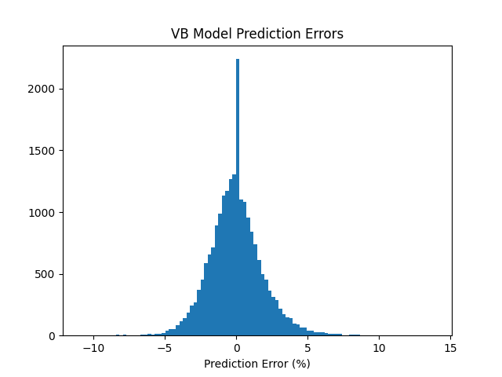
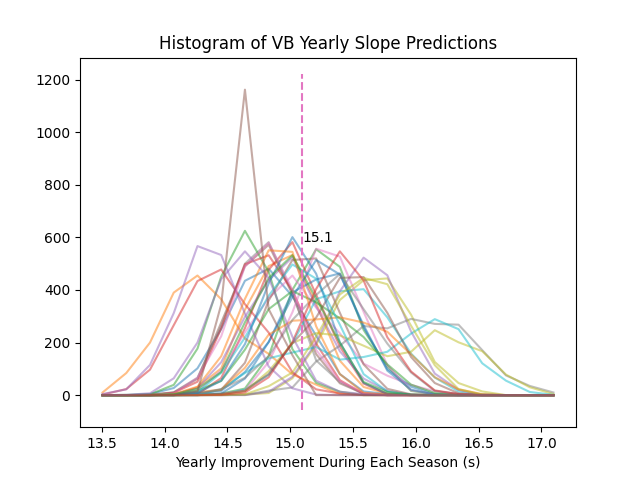
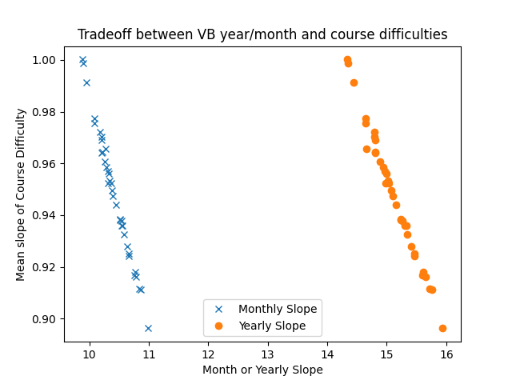

## Introduction
This code estimates the difficulty of California cross country (XC) courses. 
The goal is to provide a single number that models each course's difficulty 
and can be used to adjust expected race times across courses.
For example, course A might be 1.1 times harder than course B,
and thus the expected times for course A will be 10% higher.
The final results are here. You can click on a column header to sort the
table by that column.

  * [Course difficulties for all California](https://malcolmslaney.github.io/CrossCountryStats/Results/course_difficulties.html), 
  * [Course difficulties for those run by Bay Area Peninsula teams](https://malcolmslaney.github.io/CrossCountryStats/Results/course_difficulties_local.html).

These results are normalized to times from Crystal Springs, which therefore
has a difficulty of 1.0. 
Given a runner's time at Crystal, 
you can predict their time at another course by 
multiplying by that course's difficulty factor (i.e. 1.2).
In other words, a difficulty factor of 1.2 means that on average a runner's
time will be 20% longer then their time at Crystal.
If you have their time at another course you first *divide* their time by 
that course's difficulty factor, 
thus giving you an estimate of their Crystal time, 
then *muliply* by the difficulty of the course that you care about.

## The Mathematical Model
This task would be easy if we had runners who competed on all courses.
But we do not.  Instead we have Kent who has run courses A and B, and we
have Donald who has run courses B and C. Since we have times for both runners
on course B, we can calculate the difference between these two runners, and 
thus estimate the difficulty of courses A and C. 
For the boys we have 70696 equations (race results) with
3919 boy variables (their abilities) 
and 443 course variables (their difficulties).
We can solve this problem using algebra, but it's better to use Bayesian 
modeling so we can add probabilistic information to the solution.
This includes assumptions such as the distribution of runner's
performance will be roughly a Gaussian.

Using race results from [XCStats](https://xcstats.com/)
over multiple years,
this code builds a model that takes into account these different factors:

  * Course difficulty
  * Runner's inate ability
  * Average runner's month-to-month improvement over the season
  * Average runner's year-to-year improvement over their career

The model estimates a single number (ability or difficulty) for 
each runner and each course.
While the month-to-month and year-to-year parameters
are averages that apply to all runners.

To be more specific, given each runner's race times, 
the model fits parameters
to a mathematical model that looks like this:

```
race_time = (average_race_time - race_month*month_slope - student_year*year_slope)
            * runner_ability * course_difficulty
``````
Here, the race times are in seconds.
The race_month is the numerical month, starting with September which is 0.
The student_year is the high-school year of the student, where freshman is 0.
Thus the slopes are in terms of seconds per month or year, 
to make the results easier to interpret.

There is an individual parameter for each runner's ability, and as well as an
individual course_difficulty for each course.  These are both
multiplicative factors that modify the expected race time during the season. 
Both factors adjust the
expected times, but in different fashions.  So higher (>1) course difficulties
represent *harder* courses.  While lower (<1) runner abilities represent *faster*
runners. In both cases, higher numbers translate to longer finish times.

## [Bayesian Modeling](https://www.publichealth.columbia.edu/news/what-bayesian-modeling#:~:text=Bayesian%20modeling%20is%20able%20to,estimated%20toxicities%20of%20certain%20pollutants.)
We use a Bayesian framework to derive a probabilistic model to explain
the observed data (runner's race times).
In a Bayesian model all the parameters of the model are random
variables. We don't know Kent's true ability, so it is a random variable. 
Likewise, the difficulty of Crystal changes with the weather and other variables
we do not have control over. Our goal is to find probability distributions that
are as narrow as possible to explain the observed data.

By way of contrast, a deterministic model such as linear regression finds the
model parameters that produce the smallest possible total error
(in the mean-squared sense)
when predicting the observed times.
Instead, here we use a Bayesian model so we can model and 
describe the uncertainties in our predictions.

An important part of Bayesian modeling is providing information about 
expectations of the parameters. In this case, we wish the course and runner
parameters to be approximately 1.0. This kind of constraint is added to the 
Bayesian model in the form of prior distributions.

We have 4 years of high school race results from the subscribers to
[XCStats.com](xcstats.com).
This includes 70k boys results and 63k girls results.
For the analysis presented here, we use the runners with times in the top 25\%
of each race, hypothesizing that these are likely to be the more serious runners
and will show less variance in their performance.
This left us with 22k boys
results and 19k girls results.
Our boy's model was traimed with 3919 runners 
running 443 courses.
While the girl's model was trained with 3229 runners running
432 courses.

Given our race results, we find the probability distribution for the parameters
that best explains the data using a
Python package called [PyMC](https://www.pymc.io/welcome.html).


## Results

The goal of this exercise is to estimate the relative difficulty of each course
in our dataset. Here are the results for a number of courses run by local 
high school teams (Palo Alto, Los Altos, Archbishop Mitty, and Lynbrook).
The name of each course is followed by its distance in miles.

|Index | Course Name                      | Boys Difficulty | Girls Difficulty | # Boys | # Girls |
|-----:|---------------------------------:|----------------:|-----------------:|-------:|--------:|
|  365 | RL Stevenson HS (1.6)            | 0.523           |0.510             |   82   |    73   |
|   43 | Woodward Park (2.0)              | 0.646           |0.645             |   53   |    51   |
|   20 | Lynbrook HS (2.1)                | 0.650           |0.643             |  330   |   336   |
|  311 | Fremont HS (2.05)                | 0.650           |0.646             |   23   |    23   |
|   81 | Hidden Valley Park (2.0)         | 0.659           |0.661             |  624   |   624   |
|  255 | Bol Park (2.18)                  | 0.678           |0.667             |  131   |   104   |
|  203 | Prospect HS (2.15)               | 0.681           |0.687             |   19   |    20   |
|  273 | Lagoon Valley Park (2.0)         | 0.698           |0.702             |  100   |    79   |
|  333 | North Monterey County HS (2.4)   | 0.727           |0.721             |   14   |    13   |
|  182 | Westmoor HS (2.33)               | 0.740           |0.741             |  109   |    83   |
|  339 | Central Park (2.3)               | 0.741           |0.740             |  271   |   265   |
|   76 | Westmoor HS '18 (2.4)            | 0.782           |0.759             |   91   |    50   |
|  271 | Westmoor HS (2.4)                | 0.782           |0.779             |  243   |   190   |
|  220 | Golden Gate Park (2.82)          | 0.913           |0.903             |  212   |   174   |
|  217 | Golden Gate Park (2.93)          | 0.947           |0.944             |  761   |   635   |
|  276 | Newhall Park (2.95)              | 0.961           |0.953             |  139   |   115   |
|  117 | North Monterey County HS (3.0)   | 0.964           |0.964             |   54   |    58   |
|  231 | GGP - WCAL pre 2022 (3.0)        | 0.984           |0.980             |  156   |   135   |
|  247 | Kualoa Ranch (3.0)               | 0.992           |0.979             |   68   |    69   |
|   17 | Haggin Oaks Golf Course (3.1)    | 0.993           |0.984             |  758   |   683   |
|  305 | Stanford Golf Course (3.1)       | 0.993           |0.988             | 1310   |  1106   |
|  248 | Kualoa Ranch (3.1)               | 0.995           |0.976             |   29   |    24   |
|   49 | Elkhorn Country Club (3.1)       | 0.996           |0.986             |  773   |   674   |
|  332 | Newhall Park (3.0)               | 0.997           |0.991             |  877   |   787   |
|  155 | Crystal Springs (2.95)           | 1.000           |1.000             | 2728   |  2552   |
|  253 | Mt. Sac (2.93)                   | 1.001           |1.005             | 3407   |  3080   |
|  126 | Woodward Park (3.1)              | 1.012           |1.006             | 5473   |  5264   |
|  224 | Lagoon Valley Park (3.0)         | 1.017           |1.015             |  508   |   403   |
|    8 | Hidden Valley Park (3.0)         | 1.018           |1.013             |  362   |   313   |
|  272 | Baylands Park (3.1)              | 1.019           |1.016             |  685   |   684   |
|  396 | Toro Park (3.0)                  | 1.023           |1.023             |  704   |   665   |
|  123 | Glendoveer Golf Course, OR (3.1) | 1.052           |1.041             |   54   |    58   |
|  179 | Mt. Sac (3.1)                    | 1.053           |1.017             |   21   |    10   |

Our model has three point variables 
(average_race_time, monthly_slope, yearly_slope) and two vector variables
(runner_ability, course_difficulty). The runner and course variables have 
one value for each runner and each course, respectively.
Runners typically improve month over month
during the season, and each year they participate in XC.
This model predicts the following improvements:

| | Monthly Improvement | Yearly Improvement |
|----:|:----:|:---:|
| Boys | 10.5s | 15.2s |
| Girls | 16.4s | 9.6s |

[I don't know why the slopes are so different between boys and girls.  Perhaps
a function of the girl's earlier maturity?]

The distribution of course difficulties is shown in the next figure below.
Most courses are about 3 miles long, and they form the bulk of the difficulties
around 1.0. But some are much shorter (2 miles is common) and one, not shown,
is much longer.


We don't have the same amount of data for each runner. The histogram below shows
the distribution of races per runner.


This code makes predictions of each runner's time on each course. We can plot
the *training* error to get a sense of the model's accuracy.  
This is shown below for the full model.



We build our model using a combination of normal (Gaussian) and gamma
prior distributions.  
Here are the priors for each model:

| | Distribution mean| Distribution sigma |
|----:|:----:|:---:|
| Monthly Slope | 10.0 | 10.0 |
| Yearly Slope | 10.0 | 10.0 |
| Course Difficulty| 1.0 | 1.0 |
| Runner Ability | 1.0 | 0.25 |

These prior distributions lead to these prediction errors.
They produce different errors, but most importantly.
the gamma model produces fewer MCMC diversions, suggesting it is better 
behaved.  

| | Normal | Gamma |
|----:|:----:|:---:|
| VB Prediction Error (%) | 1.88 | 1.88 |

Different models have different errors. We get better prediction errors
if we include the monthly and yearly slope features. This is a histogram
of the varsity boy model errors for the gamma prior.

| | Model without slopes | Full model |
|----:|:----:|:---:|
| Average Prediction error (%) | 2.05 | 1.88 |

### Ill Posed
Note, the *raw* outputs from this model are unnormalized and should be considered
*relative* results. 
While both the ability and difficulty numbers tend to be close to 1, 
their baselines are arbitrary.
Thus an average course_difficulty of 0.5 and an average runner ability of 2 will
produce the same overall race-time predictions as the reverse.

Thus this model is [ill-posed](https://en.wiktionary.org/wiki/ill-posed)
and this affects our analysis. 
We have a multiplicative model and in effect we are multiplying A x B x C to predict D.
While we have constraints on the expected values of A, B, and C (via a prior
distribution), a larger value of A can be matched with lower values for B and C
to predict the same observed race time. 
This affects the model's slope parameters, but we are interested in the 
relative course difficulties, so we normalize all results to the difficulty
of the Crystal Springs course, and the ill-posed nature is washed out.

[MCMC](https://en.wikipedia.org/wiki/Markov_chain_Monte_Carlo) predicts the
distribution of each model parameter by finding values that result in a high
likelihood when scoring the observed data.
Each time MCMC is run it produces a "trace" of all the model parameters that 
explain the data.  The values of the trace are an empirical description of the 
probability distribution for that model parameter. Most importantly, since
the trace is random, some traces might assume a lower value of A, and thus 
high values of B or C, all to explain the same observed data.

The randomness of each trace makes it a litte harder to draw conclusions. 
For the results presented here, we computed 36 traces, 
with 2000 samples of each model parameter
(this took about 3 hours for each gender's data).
The final course difficulty numbers are based on averaging all 72000 trace
samples for each course, and then dividing by the average difficulty of the 
Crystal Springs course, our baseline course.

### Slope Results
The distribution of the monthly slope for the varsity boys is shown below
for each of the eight traces.


We can do the same plot for the improvement of the varsity boys year over year.



The next figures shows the tradeoff between course difficulties and slopes.



First consider the blue x's.  When the monthly slope is high 
(the group of blue points to the right) the
corresponding course difficulty is relatively low (to the bottom).
Conversely, where the slopes are low (the blue group on the left), 
the course difficulties are higher (upper left.) This suggests that the model
balances low (or high) slopes with high (or low) difficulties.  Likewise we
see the same behavior for the yearly slopes.

For the slopes in the table above we took the average value over all traces.
For the course difficulties, which is the primary purpose of this model, we
report the result after normalizing each trace's results to the 
Crystal Springs time, and thus this factor doesn't apply.

You can see all these difficulty factors in the interactive comparison 
viewer that is linked here.  You can zoom and move around to explore the data.
[Course Difficulty Comparison Viewer](https://malcolmslaney.github.io/CrossCountryStats/Results/vb_vg_difficulties_comparison.html)
